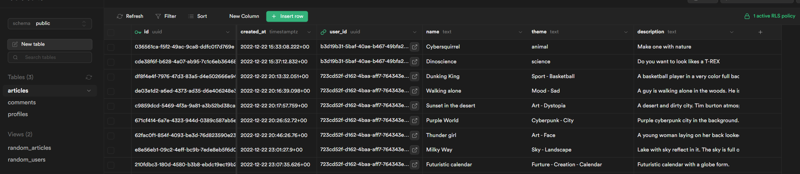
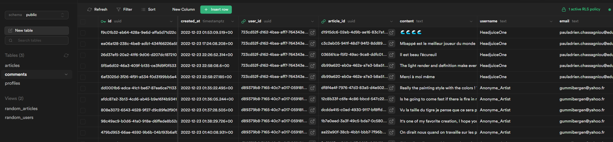
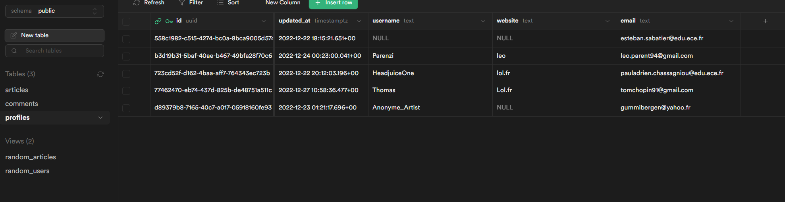

# Blogging application - ECE Webtech project

*This project is a website of IA art called "IArtist". The website is an art gallery where you can see and share IA generated artworks by a new generation of artists.*

## Production 

*You can directly access to our deployed project by clicking on the link below :*

- Vercel URL : https://iartist.vercel.app/
- Supabase project URL : https://app.supabase.com/project/skosgopoasczfbihkylx

We need your email to invite you to see our supabase project. So we put here some screenshots if you want to see our database :




## Usage

*Follow these steps to run the project :*

* Clone this repository, from your local machine:
  ```
  git clone git@github.com:leoparent/WebSI_PARENT_CHASSAGNOU.git
  ```
* Start the the application
  ```bash
  cd WebSI_PARENT_CHASSAGNOU/app
  # Install dependencies (use yarn or npm)
  npm install
  # Start the front-end
  npm run dev
  ```

## Authors

- Paul-Adrien Chassagniou pauladrien.chassagniou@edu.ece.fr  
- Léo Parent leo.parent@edu.ece.fr

## Tasks
  
**Project management:**

* Naming convention   

  *Graduation : 2/2*  
  - Components start with capital letter  
  - Pages start with small letter  
  - Code is formated by Prettier Extension  

* Project structure     

  *Graduation : 2/2*  
  - components : contains all components
  - pages : contains all pages
    - page : folder contain dynamic routing page for article

  - public : contains public images
  - contexts : contains User context variables
  - styles : contains style

* Git   

  *Graduation : 2/2*  
  We used conventionnal commits and we created a branch "projet" for the project.

* Code quality  

  *Graduation : 4/4*  
  The code is pretty easy to understand and is formated by Prettier Extension.

* Design, UX, and content

  *Graduation : 4/4*  
  *We put a special effort to create a functionnal and also well designed website.
  Our artistic content and artistic direction make our website great-looking.  
  The website is responsive and you can fully use it from your phone.*

**Application development:**

* Home page   

  *Graduation : 2/2*  
  On the home page, you'll see a mosaic of randoms images from the collection. You have a button who invites you to see the collection of IArt.

* Login and profile page  

  *Graduation : 4/4*  
  We use OAuth component in order to sign in and sign up. You can use the GitHub provider to sign in directly from your GitHub account. If you sign up, you'll receive an email confirmation.  
  If nothing happened after clicking on sign in or when you click on sign out in the profile settings, just refresh the page using f5 and it'll resolve the problem.

* New articles creation  

  *Graduation : 6/6*  
  When you are connected, you'll have a "New" button, if you click on it you can choose the "New Post" button. Here you'll be able to drag'n drop or select a image by clicking on the right side of the page. You can only select jpeg and png files. You can write the Title,Category and Description for your image.  
  You can't create your post if you don't upload an image. 

* New comment creation  

  *Graduation : 4/4*  
  If you aren't connected, you can see the collection of images but if you click on one of them, you'll be redirected to the login page. Only connected user, can see the informations about a post and comment, etc.  
  If you are connected, you can comment any image you want.

* Resource access control

  *Graduation : 6/6*     
  If a user is not logged, he can see the collection but when he'll click on a post it will redirect him to the login page. An unlogged user can't see image informations, comments, can't write comments. He can't see his profile settings, his personnal collection and for sure create a post and share it.
  If you try to access to theses pages by the URL directly, you'll be redirect to the login page.  
  If a user is logged, he can fully access to the website and will be able to create, update , delete posts and comments.

* Article modification  

  *Graduation : 4/4*  
  If you click on an image you created, you'll the your image informations with the possibility to update. Because you created the image, you can delete anyone's comments on your post.

* Article removal  

  *Graduation : 2/2*  
  In the same way, you also have a delete button to delete your post if you want. It will remove all the comments associated to your post as well.

* Comment modification 

  *Graduation : 2/2*  
  No matter if it's your post or not, you can always modify your comment. You have a modify button. If you click on it, it will transform your comment into a textbox and if you click on Modify again it will update your comment.

* Comment removal   

  *Graduation : 2/2*  
  In the same way, you can delete your comments no matter if it's your post or not. If it's your post, you can also delete other people comments.

* Account settings  

  *Graduation : 4/4*  
  If you click on your profile icon in the right-top corner of every page, you'll see the profile settings page. You can sign out, update your username and website informations, select the color theme.

* WYSIWYG integration  

  *Graduation : 0/2*  
  We didn't use WYSIWYG text editor because we found no need in the integration of it unlike a text article blog website could have. All the textboxs we have are for small texts such as the title or short description of an image.

* Gravatar integration  

  *Graduation : 2/2*  
  In every right-top corner of page, you'll see the gravatar Icon. In the profile settings, you'll see it bigger and you can click on the image, it'll redirect you to the Gravatar website in order to link your email to a Gravatar image.

* Light/dark theme  

  *Graduation : 2/2*  
  You have a sun/moon icon to change the light/dark theme of the website. Background and texts colors, and images will change.

* Accent color selection  

  *Graduation : 4/4*  
  In the profile settings, you'll find 5 buttons to change the color theme of the website. We choose to change only the header and footer color for aesthetic reason.

## Bonus

* Responsive   
  *All of our pages are responsive and can be displayed on all formats of screens. On mobile/tablet screens, the menu is accessible from a hamburger button at the right-top corner of the screen. We put a lot of effort to make it fully usable on all devices*

* Emoji Integration  
  *We didn't use WYSIWYG Integration because we found it not necessary but we add in comments textboxs emoji button allows you to search and put emojis in your comments.*

* Personnal Collection  
  *In the "New" dropdown button, you can click on "My collection". It'll show you your personnal collection. It's easier than finding our own publications in the general collection.*
